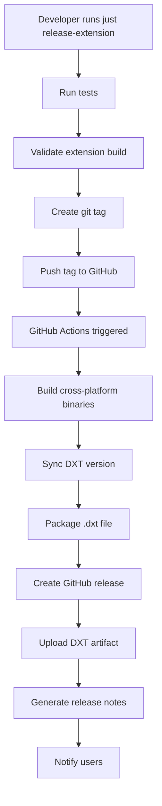

# Release Process Guide

This document outlines the automated release process for the Kite Connect Desktop Extension.

## Quick Release

For a standard release with full automation:

```bash
# Create and push a release tag
just release-extension 1.0.0
git push --tags
```

This will:
1. ✅ Run all tests
2. ✅ Validate extension build
3. ✅ Create git tag
4. 🤖 Trigger GitHub Actions automation
5. 🚀 Create GitHub release with DXT artifact

## Manual Release (if needed)

For manual control or troubleshooting:

```bash
# 1. Create tag only
just release 1.0.0

# 2. Build extension locally
just build-extension

# 3. Package extension
just package-extension

# 4. Push tag to trigger automation
git push --tags
```

## Release Automation Flow



## What Gets Automated

### ✅ Fully Automated
- Cross-platform binary compilation (5 platforms)
- DXT version synchronization with git tags
- Extension packaging using DXT CLI
- GitHub release creation with artifacts
- Release notes generation
- Installation instructions

### 📋 Manual Steps (Optional)
- Submission to Anthropic's curated directory
- Enterprise distribution setup
- Marketing announcements

## Monitoring Releases

### GitHub Actions
- Monitor workflow: `https://github.com/OWNER/REPO/actions`
- Check logs for detailed build information
- Verify artifact uploads

### Release Verification
```bash
# Check latest release
gh release view --web

# Download and test DXT file
gh release download --pattern "*.dxt"
```

## Version Strategy

### Semantic Versioning
- `v1.0.0` - Major release
- `v1.1.0` - Minor release (new features)
- `v1.0.1` - Patch release (bug fixes)

### Pre-release Versions
- `v1.0.0-beta.1` - Beta release
- `v1.0.0-rc.1` - Release candidate
- `v1.0.0-dev.1` - Development build

### Automatic Version Sync
Git tags are automatically converted to DXT-compatible versions:
- `v1.0.0` → `1.0.0`
- `v1.0.0-beta.1` → `1.0.0-beta.1`
- `v1.0.0-dev.5-g1234abc` → `1.0.0-dev.5`

## Distribution Channels

### 1. GitHub Releases (Immediate)
- Direct download of `.dxt` files
- Manual installation in Claude Desktop
- Available immediately after automation

### 2. Anthropic Directory (Future)
- Automatic updates for users
- One-click installation
- Requires manual submission and review

### 3. Enterprise Distribution
- Private extension directories
- Group Policy deployment
- MDM management

## Troubleshooting

### Common Issues

**Build Failures:**
- Check Go version compatibility (1.24+)
- Verify all tests pass locally
- Ensure clean git working directory

**DXT Packaging Errors:**
- Install DXT CLI: `npm install -g @anthropic-ai/dxt`
- Verify Node.js version (16+)
- Check manifest.json syntax

**Version Sync Issues:**
- Install jq: `brew install jq` or `apt-get install jq`
- Verify git tags exist: `git tag --list`
- Check script permissions: `chmod +x sync-version.sh`

### Manual Recovery

If automation fails, you can always build and release manually:

```bash
# Build binaries
./desktop-extension-claude/build-binaries.sh

# Package extension
cd desktop-extension-claude && dxt pack .

# Create GitHub release manually
gh release create v1.0.0 --title "v1.0.0" --generate-notes desktop-extension-claude/*.dxt
```

## Security Considerations

- All builds run in isolated GitHub Actions environment
- No secrets required for public releases
- DXT files are signed by DXT CLI during packaging
- Source code is publicly auditable

## Performance

- **Build time**: ~5-10 minutes for full automation
- **Artifact size**: ~50-100MB (includes all platform binaries)
- **Distribution**: Available immediately via GitHub CDN