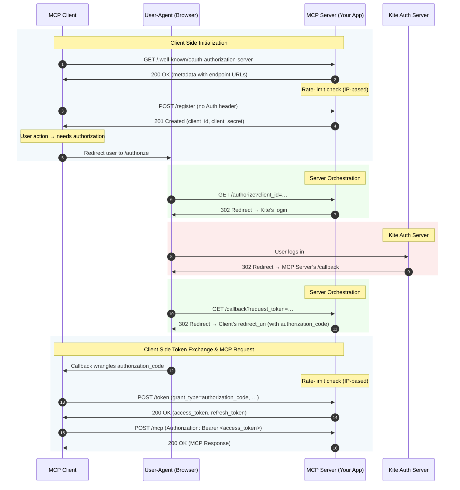

# OAuth 2.1 Authorization Server

## 1. Overview

This document outlines the OAuth 2.1 compliant authorization server implemented for the Kite MCP Server. The primary purpose of this server is to protect the `/mcp` endpoint, enabling secure, standardized authentication and authorization for both end-users and machine-to-machine (M2M) clients.

This implementation adheres to the following standards:
-   **OAuth 2.1 (Draft)**: Core flows including Authorization Code with PKCE and Client Credentials.
-   **RFC 7591**: Dynamic Client Registration (manual implementation).
-   **RFC 8414**: Authorization Server Metadata (discovery).

The server uses **opaque access tokens** generated via an HMAC-SHA256 strategy. This means tokens do not contain data and must be validated against the server's `/introspect` endpoint.

## 2. Supported Grant Types

The server supports two primary grant types to cover different use cases.

### 2.1. Authorization Code Grant

-   **Use Case**: Delegated authorization, where an end-user grants an MCP client (e.g., a CLI tool, a web application) permission to access their Kite account on their behalf.
-   **Security**: This flow is secured with **Proof Key for Code Exchange (PKCE)**, which is mandatory for all clients as per the OAuth 2.1 specification.

### 2.2. Client Credentials Grant

-   **Use Case**: Machine-to-machine (M2M) authentication, where a backend service or script authenticates itself to access its own resources or perform actions not on behalf of a specific user.
-   **Security**: Requires a confidential client with a `client_id` and `client_secret`.

## 3. Endpoints

The server exposes the following standard OAuth 2.1 endpoints. All unauthenticated public endpoints are protected by IP-based rate limiting.

| Path                                     | Method | Description                                                                                             | Authentication |
| :--------------------------------------- | :----- | :------------------------------------------------------------------------------------------------------ | :------------- |
| `/register`                              | `POST` | Dynamically registers a new OAuth client.                                                               | None           |
| `/authorize`                             | `GET`  | Starts the Authorization Code Grant flow, redirecting the user to Kite for authentication.                | None (Browser) |
| `/token`                                 | `POST` | Exchanges an authorization code or client credentials for an access token.                              | Client Auth    |
| `/.well-known/oauth-authorization-server` | `GET`  | Provides server metadata for automatic client configuration (discovery).                                | None           |
| `/callback`                              | `GET`  | The internal callback endpoint that Kite redirects to after user authentication. **Not for direct use.** | None (Browser) |

## 4. Client Registration

To be compatible with clients like `mcp-remote`, the server supports unauthenticated dynamic client registration as specified in RFC 7591.

-   **Endpoint**: `POST /register`
-   **Security**: This endpoint does not require an initial access token but is protected by **aggressive, IP-based rate limiting** to prevent abuse and denial-of-service attacks.

A client registers itself by sending its metadata (e.g., `client_name`, `redirect_uris`) and receives a unique `client_id` and `client_secret` in response.

**Example Registration Request:**
```bash
curl -X POST http://localhost:8080/register \
-H "Content-Type: application/json" \
-d '{
  "client_name": "My Awesome MCP Client",
  "redirect_uris": ["http://localhost:3000/callback"],
  "grant_types": ["authorization_code", "refresh_token"]
}'
```

## 5. Authorization Code Flow Explained

This flow is the most complex, as it orchestrates interactions between the MCP client, the end-user's browser, your MCP server, and the Kite authentication server.




### Step-by-Step Breakdown:
1.  **Discovery & Registration:** The client discovers endpoints and registers itself to get credentials.
2.  **Authorization Request:** The client redirects the user's browser to the `/authorize` endpoint on your server.
3.  **Kite Authentication:** Your server receives the request, creates a temporary session to store the pending OAuth flow, and redirects the user to Kite to log in securely.
4.  **Callback to Your Server:** After a successful Kite login, Kite redirects the user back to your server's `/callback` endpoint with a `request_token`.
5.  **Flow Resumption:** Your callback handler validates the temporary session, uses the `request_token` to fetch the user's Kite ID, and generates a one-time `authorization_code`.
6.  **Callback to Client:** Your server redirects the browser back to the client's registered `redirect_uri` with the `authorization_code`.
7.  **Token Exchange:** The client's backend makes a direct `POST` request to your `/token` endpoint, exchanging the `authorization_code` (and its PKCE `code_verifier`) for an access token.
8.  **API Access:** The client now has an access token, which it can use to make authenticated requests to the `/mcp` endpoint. The subject (`sub`) of this token is the user's unique Kite ID.

## 6. Protecting the `/mcp` Endpoint

The `oauthMiddleware` is responsible for securing the `/mcp` endpoint. It enforces OAuth 2.1 Bearer Token authentication for all requests.

1.  The middleware inspects the `Authorization: Bearer <token>` header. Requests without a valid token are rejected with a `401 Unauthorized` status.
2.  It calls Fosite's `IntrospectToken` to validate the token.
3.  If the token is valid, it extracts the subject (the Kite User ID).
4.  It **sets the `Mcp-Session-Id` header on the request** with the Kite User ID before passing it to the downstream MCP handler.

This design ensures that all access to the `/mcp` endpoint is authenticated via OAuth, while using the Kite User ID from the token as a stable session identifier for the duration of the request. The legacy `Mcp-Session-Id` header is still used by other server modes like SSE, but for the `/mcp` endpoint, it is derived exclusively from the OAuth token.

## 7. Security Considerations

-   **PKCE**: Enforced for the Authorization Code flow to prevent authorization code interception attacks.
-   **Rate Limiting**: All unauthenticated endpoints (`/register`, `/authorize`, `/token`) are protected by IP-based rate limiting to mitigate abuse.
-   **HTTPS**: The server **MUST** be deployed behind a TLS-terminating proxy in production. All OAuth 2.1 flows require HTTPS.
-   **Opaque Tokens**: Access tokens are high-entropy, random strings. They leak no internal information and can be revoked instantly on the server side.
-   **State Parameter**: The `state` parameter is used during the authorization flow to prevent Cross-Site Request Forgery (CSRF) attacks.

## 8. Production Readiness

The current implementation uses an `InMemoryStore` for storing OAuth data (clients, codes, tokens). For a production environment, this **MUST** be replaced with a persistent database store (e.g., PostgreSQL, MySQL).
